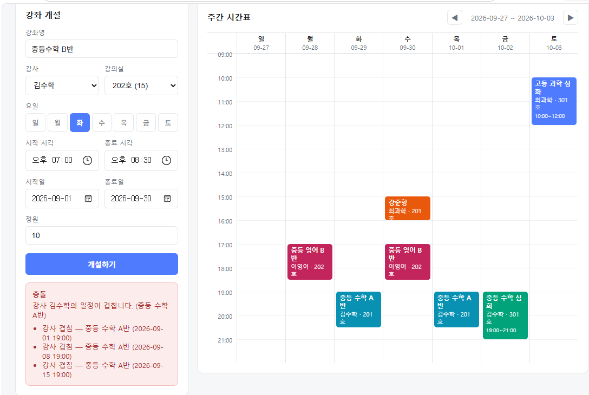

# EduFlow

> 학원 수업·예약 관리 플랫폼. 강사·강의실의 시간 충돌을 방지하는 예약 처리에 초점을 맞췄다.

## 데모

동시에 들어온 요청이 서로를 덮어쓰지 못하게 막는 것이 이 프로젝트의 주제다.



> 이미 그 시간에 수업이 있는 강사·강의실로 강좌를 만들려 하면 개설이 거절된다.
> 화면에서 막는 것이 아니라 트랜잭션 안에서 잠금으로 막는다. (아래 트러블슈팅 1번)

```
$ npm run stress:enroll        # 정원 5명 강좌에 20명이 동시 신청

── 잠금 없음 — COUNT 로 세고 INSERT
   수락 / 거절    10 / 10
   실제 등록 인원  10명  (정원 5명)
   ❌ 정원 초과 5명

── UPDLOCK — 강좌 행을 잠그고 검사
   수락 / 거절    5 / 15
   실제 등록 인원  5명  (정원 5명)
   ✅ 정원 이내
```

> 배포 링크는 없다. MSSQL은 무료 관리형 선택지가 사실상 Azure 하나뿐이라
> 아래 **실행 방법** 대로 로컬에서 바로 띄울 수 있게 해두었다. 명령 네 줄이면 된다.

## 구현 현황

| | 상태 |
|---|---|
| 강좌 개설 + 강사·강의실 시간 충돌 방지 | 완료 |
| 수강신청 + 정원 초과 방지 | 완료 |
| 인증 (JWT · httpOnly 쿠키) + 역할별 권한 | 완료 |
| 주간 시간표 화면 (React) | 완료 |
| 출결 처리 | 미구현 |

**테스트 계정** — `npm run seed` 후 사용. 비밀번호는 전부 `eduflow123!`

| 이메일 | 역할 |
|---|---|
| `admin@eduflow.test` | 관리자 — 강좌 개설 |
| `teacher1@eduflow.test` | 강사 |
| `student1@eduflow.test` | 학생 — 수강신청 |

## 기술 스택

| 구분 | 기술 |
|---|---|
| Runtime | Node.js 20 |
| Backend | Express 5 |
| Database | SQL Server 2022 |
| Driver | mssql (tedious) |
| Frontend | React 19 + Vite |
| 인증 | JWT (httpOnly 쿠키) + bcrypt |

## 프로젝트 구조

```
eduflow/
├─ server/                 백엔드
│  ├─ src/
│  │  ├─ routes/           HTTP 경계 (검증은 서비스에 맡긴다)
│  │  ├─ services/         비즈니스 로직 · 트랜잭션
│  │  └─ middleware/       인증 · 역할 확인
│  ├─ db/migrations/       스키마 (SQL)
│  └─ scripts/             마이그레이션 · 시드 · 부하 테스트
└─ client/                 프론트엔드 (React)
```

## 실행 방법

```bash
npm run setup                        # 의존성 설치
cp server/.env.example server/.env   # DB 접속 정보 입력
npm run migrate                      # 테이블 생성
npm run seed                         # 샘플 데이터

npm run dev          # 터미널 1 — API 서버 (localhost:3000)
npm run dev:client   # 터미널 2 — 화면    (localhost:5173)
```

브라우저는 **http://localhost:5173**. 위 테스트 계정으로 로그인한다.

```bash
npm run stress:enroll   # 정원 초과 방지 검증 (잠금 있음/없음 비교)
```

환경 세팅과 작업 이어하기는 [docs/DEVELOPMENT.md](docs/DEVELOPMENT.md) 참고.

| 엔드포인트 | 설명 |
|---|---|
| `GET /health` | 서버 상태 |
| `GET /health/db` | DB 연결 상태 |
| `POST /api/auth/login` | 로그인 (토큰을 httpOnly 쿠키로 발급) |
| `POST /api/auth/logout` | 로그아웃 |
| `GET /api/auth/me` | 로그인 상태 확인 |
| `GET /api/courses` | 강좌 목록 |
| `POST /api/courses` | 강좌 개설 — **관리자만**. 회차 자동 생성 + 충돌 검사 |
| `GET /api/courses/:id` | 강좌 상세 + 회차 목록 |
| `GET /api/timetable?from=&to=` | 기간별 시간표 |
| `POST /api/enrollments` | 수강신청 — **학생만**. 정원 초과 차단 |
| `DELETE /api/enrollments/:courseId` | 수강 취소 |
| `GET /api/enrollments/me` | 내 수강 목록 |

신청 대상 학생은 요청 본문이 아니라 토큰에서 가져온다.
본문으로 받으면 남의 이름으로 신청하는 요청을 막을 수 없다.

강좌 개설 요청 예시:

```json
{
  "title": "중등 수학 A반",
  "teacherId": 5,
  "roomId": 2,
  "capacity": 10,
  "startDate": "2026-09-01",
  "endDate": "2026-11-30",
  "schedules": [
    { "dayOfWeek": 2, "startTime": "19:00", "endTime": "20:30" },
    { "dayOfWeek": 4, "startTime": "19:00", "endTime": "20:30" }
  ]
}
```

`dayOfWeek`는 0(일)~6(토). 기간과 요일 패턴으로 수업 회차를 전부 생성하며,
강사 또는 강의실 일정이 겹치면 `409`와 함께 겹치는 수업 정보를 돌려준다.

## 도메인

| 역할 | 기능 |
|---|---|
| 학생 | 수업 조회·신청·취소, 내 시간표, 출결 확인 |
| 강사 | 담당 수업·수강생 조회, 출결 처리 |
| 관리자 | 회원·강사·강좌 관리, 시간표 편성 |

## ERD

```
users ──┬─(teacher_id)─→ courses ──→ lessons ──→ attendances
        └─(student_id)─→ enrollments        ↗
                          rooms ────────────┘
```

| 테이블 | 설명 |
|---|---|
| `users` | 학생·강사·관리자 (role로 구분) |
| `rooms` | 강의실 |
| `courses` | 강좌 (예: 중등 수학 A반) |
| `course_schedules` | 강좌의 반복 패턴 (매주 화·목 19시) |
| `lessons` | 실제 수업 회차 (날짜별 1행) |
| `enrollments` | 수강 신청 |
| `attendances` | 출결 (회차 × 학생) |

## 설계 노트

**회차를 실제 행으로 생성한다**

`courses`에 반복 패턴만 저장하지 않고 `lessons`에 날짜별 회차를 만들어 둔다.
휴강·보강처럼 특정 회차만 바뀌는 경우를 패턴만으로는 표현할 수 없기 때문이다.
`lessons`가 강사·강의실을 직접 들고 있어 대강과 강의실 변경도 회차 단위로 처리된다.

**중복 수강신청은 필터링된 유니크 인덱스로 막는다**

`(course_id, student_id)`에 일반 UNIQUE를 걸면 취소한 학생이 재신청할 수 없다.
살아있는 신청에만 유니크를 적용해 이 문제를 피했다.

```sql
CREATE UNIQUE INDEX UX_enrollments_active
    ON enrollments (course_id, student_id)
    WHERE status = 'active';
```

## 트러블슈팅

### 1. 동시 요청에서 시간 충돌 검사가 뚫린다

**문제**

"이 강사가 그 시간에 수업이 있는지" 확인한 뒤 회차를 넣는 구조였다.
단건 요청으로는 정상 동작했지만, 같은 시간대를 동시에 등록하면 충돌한 강좌가 함께 생성됐다.

**원인**

검사와 삽입 사이에 다른 트랜잭션이 끼어들 수 있었다.

```
트랜잭션 A: 겹치는 수업 조회 → 없음
트랜잭션 B: 겹치는 수업 조회 → 없음   (A가 아직 커밋 전이라 보이지 않음)
트랜잭션 A: 회차 삽입 → 성공
트랜잭션 B: 회차 삽입 → 성공          ← 겹치는 회차가 생김
```

읽은 행을 잠가도 소용이 없다. 아직 존재하지 않는 행이 나중에 삽입되는
팬텀(phantom) 문제라, 없는 행에 대한 잠금이 필요했다.

PostgreSQL에는 시간 겹침을 막는 `EXCLUDE` 제약이 있지만 SQL Server에는 없어서
직접 해결해야 했다.

**해결**

충돌 검사 쿼리에 `UPDLOCK, HOLDLOCK` 힌트를 걸었다.
`HOLDLOCK`은 조회 범위에 범위 잠금(range lock)을 걸어, 같은 범위에 대한
다른 트랜잭션의 삽입을 커밋 시점까지 막는다.

```sql
FROM cand
JOIN lessons l WITH (UPDLOCK, HOLDLOCK)
  ON l.status <> 'cancelled'
 AND (l.teacher_id = @teacherId OR l.room_id = @roomId)
 AND cand.start_at < l.end_at
 AND l.start_at   < cand.end_at
```

교착 상태(오류 1205)는 요청이 잘못된 게 아니라 타이밍 문제이므로
최대 3회까지 재시도하도록 했다.

**결과**

같은 강사·같은 시간에 동시 요청 8건을 보내 비교했다.

| | 성공 | 충돌 차단 | DB에 겹친 회차 |
|---|---|---|---|
| 잠금 없음 | 4 | 4 | **24건** |
| `UPDLOCK, HOLDLOCK` | 1 | 7 | **0건** |

잠금이 없을 때는 4개 강좌가 동시에 등록되며 겹치는 회차 24개가 실제로 저장됐다.

### 2. 정원 5명 강좌에 10명이 등록된다

**문제**

수강신청을 "현재 인원을 세고, 정원보다 적으면 넣는다"로 구현했다.
순차 요청에서는 정확했지만 동시 요청에서는 정원을 넘겼다.

**원인**

1번과 같은 검사-삽입 경쟁이지만 **성격이 다르다.**
1번은 *아직 없는 행*이 끼어드는 팬텀 문제였고, 여기서는 *이미 있는 행*을
여러 트랜잭션이 같이 세는 문제다.

```
트랜잭션 A: COUNT → 4명, 정원 5명이니 자리 있음
트랜잭션 B: COUNT → 4명, 정원 5명이니 자리 있음
트랜잭션 A: INSERT → 5명
트랜잭션 B: INSERT → 6명   ← 정원 초과
```

`COUNT`는 읽는 순간의 값일 뿐, 그 값이 유지된다는 보장이 없다.

**해결**

**강좌 행 하나**를 `UPDLOCK`으로 잠그고 그 안에서 센다.
`UPDLOCK`끼리는 호환되지 않으므로 같은 강좌를 노리는 요청이 이 지점에서 한 줄로 세워진다.

```sql
FROM courses c WITH (UPDLOCK, ROWLOCK)
WHERE c.id = @courseId;
```

1번과 달리 `HOLDLOCK`(범위 잠금)을 쓰지 않았다.
**지켜야 할 대상이 이미 존재하는 행 하나**여서 삽입될 자리까지 막을 이유가 없다.
같은 종류의 경쟁 조건이라도 무엇을 지키느냐에 따라 잠금 지점이 달라진다.

| | 강좌 개설 (1번) | 수강신청 (2번) |
|---|---|---|
| 지켜야 할 것 | 겹치는 회차가 없다는 **조건** | 정원을 넘지 않는다는 **개수** |
| 위협 | 아직 없는 행이 끼어드는 것 | 이미 있는 행을 같이 세는 것 |
| 잠금 | `UPDLOCK, HOLDLOCK` (범위) | `UPDLOCK, ROWLOCK` (행 하나) |

취소는 자리를 **늘리는** 방향이라 경쟁 조건이 없다. 잠금 없이 `UPDATE` 한 문장으로 처리한다.

**결과**

정원 5명 강좌에 20명이 동시 신청 (`npm run stress:enroll`, 4회 반복 동일).

| | 실제 등록 인원 | 정원 초과 |
|---|---|---|
| 잠금 없음 | **10명** | +5명 |
| `UPDLOCK` | **5명** | 없음 |

잠금이 없을 때 하필 10명인 것은 우연이 아니다.
커넥션 풀이 `max: 10`이라 딱 10개 요청이 동시에 `enrolled = 0`을 읽는다.
**풀을 키우면 초과 인원도 함께 늘어난다** — 부하가 커질수록 심해지는 종류의 결함이다.

비교용 무잠금 구현은 `server/scripts/stress-enroll.js` 안에만 두고 서비스 코드에는 넣지 않았다.

### 3. 임시 테이블이 다음 쿼리에서 사라진다

**문제**

회차 후보를 `#candidates` 임시 테이블에 만들어두고 다음 쿼리에서 쓰려 했는데
`Invalid object name '#candidates'` 오류가 났다. 같은 트랜잭션, 같은 커넥션인데도 그랬다.

**원인**

node-mssql의 `query()`는 내부적으로 `sp_executesql`로 실행된다.
`sp_executesql`은 자체 스코프를 갖기 때문에, 그 안에서 만든 지역 임시 테이블은
호출이 끝나는 순간 삭제된다.

**해결**

임시 테이블을 쓰지 않고 회차 후보를 CTE로 정의해 충돌 검사 쿼리와 삽입 쿼리에서
각각 계산하도록 바꿨다. 재계산 비용은 최대 1년치 날짜라 무시할 수준이다.

### 4. 날짜 계산을 JS에서 하면 시각이 밀린다

**문제**

19:00 수업을 만들었는데 저장된 값이 다른 시각이 되는 경우가 있었다.

**원인**

JS `Date` 객체를 드라이버에 넘기면 UTC로 변환된다.
`DATETIME2`는 시간대 정보가 없는 타입이라 이 변환이 그대로 오차가 된다.

**해결**

회차 생성을 SQL에서 처리해 JS `Date`를 아예 거치지 않도록 했다.
요일 계산은 서버 설정에 따라 달라지지 않도록 `SET DATEFIRST 7`로 고정했다.
